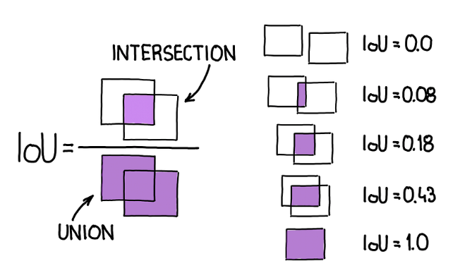
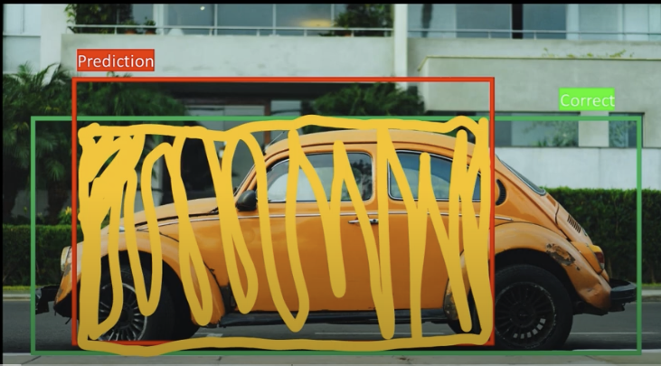

# IoU | Intersection Over Union

Prerequisite: [Understand Coordinate Formats](../understand_corner_and_mid_points.md)

**Implementation:** See [YOLO_v1_orig](../../../object_detection/yolo_v1_orig/utils/IoU.py) or [IOU.py](./utils/IOU.py) and [IOU-test.py](./utils/IOU-test.py)

**💡 Question: How do we measure how good a bounding box is?**

**Intersection over Union (IoU)** is a metric used to measure how much a predicted bounding box overlaps with a ground truth (target) bounding box. It's a fundamental tool for evaluating the accuracy of object detectors.
- The IoU score ranges from 0 to 1:
- A score of 0 means no overlap.
- A score of 1 means perfect overlap.
- The higher the IoU score, the more accurate the prediction's localization.

--- 

**Steps:**

1. Calculate the Area of **Intersection**
    - To find its area, we first need the coordinates of the intersection box itself (the yellow shaded box). Assuming we have corner points $(x_1, y_1, x_2, y_2)$ for both boxes:

    

    - Intersection box's top-left corner $(x_1, y_1)$:
        - $$x_1 = \max(\text{predBox}_{x1}, \text{trueBox }_{x1})$$

        - $$y_1 = \max(\text{predBox}_{y1}, \text{trueBox}_{y1})$$

    - Intersection box's bottom-right corner $(x_2, y_2)$:
        - $$x_2 = \min(\text{predBox}_{x2}, \text{trueBox}_{x2})$$
        - $$y_2 = \min(\text{predBox}_{y2}, \text{trueBox}_{y2})$$

    - Compute the intersection area:
        - $$ \text{Intersection} = \max(0, \; x_2 - x_1) \times \max(0, \; y_2 - y_1)$$
        - If $$x_1 \geq x_2 \;\;\text{or}\;\; y_1 \geq y_2$$, then the boxes don’t overlap and $$\text{Intersection} = 0$$.

2. Calculate the Area of **Union**
    - The union is the total area covered by both boxes, highlighted here in pink.

    

    - To avoid double-counting the overlapping area, we use the following formula:

        - $\text{Union} = \text{Predicted Box Area} + \text{True Box Area} − \text{Intersection}$

3. Calculate the IoU by plugging in the area values.

$$ IOU = \frac{\text{Intersection}}{\text{Union}}$$

