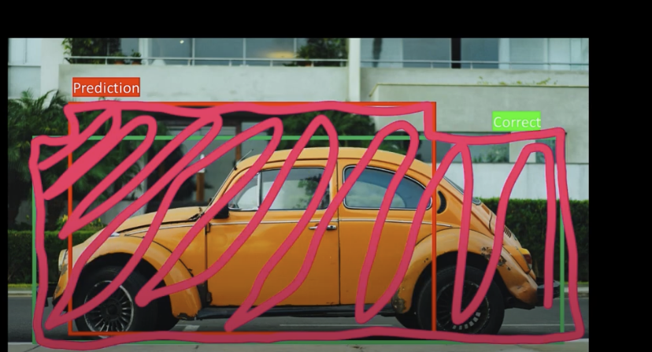

# IoU | Intersection Over Union

Prerequisite: [Understand Coordinate Formats](../understand_corner_and_mid_points.md)

**Implementation:** See [YOLO_v1_orig](../../../object_detection/yolo_v1_orig/utils/IoU.py) or [IOU.py](./utils/IOU.py) and [IOU-test.py](./utils/IOU-test.py)

**💡 Question: How do we measure how good a bounding box is?**

**Intersection over Union (IoU)** is a metric used to measure how much a predicted bounding box overlaps with a ground truth (target) bounding box. It's a fundamental tool for evaluating the accuracy of object detectors.
- The IoU score ranges from 0 to 1:
- A score of 0 means no overlap.
- A score of 1 means perfect overlap.
- The higher the IoU score, the more accurate the prediction's localization.

--- 

**Steps:**

1. Calculate the Area of **Intersection:**
    - To find its area, we first need the coordinates of the intersection box. Assuming we have **corner points** $(x_1, y_1, x_2, y_2)$ for both the predicted and true target bounding boxes:
        - The $predBox$ is the models prediction bounding box, its the red box below.
        - The $trueBox$ is the true target/label box, its the green box.
        - The Intersection box is the yellow shaded box, its the intersection where the predicted and target box intersect.

    

    

    - Find the Intersection bounding box $(x_1, y_1, x_2, y_2)$:
        - Intersection box's top-left corner $(x_1, y_1)$:
            - $x_1 = max(predBox_{x1}, trueBox_{x1})$
            - $y_1 = max(predBox_{y1}, trueBox_{y1})$

        - Intersection box's bottom-right corner $(x_2, y_2)$:
            - $x_2 = min(predBox_{x2}, trueBox_{x2})$
            - $y_2 = min(predBox_{y2}, trueBox_{y2})$

    - Compute the intersection area:
        - $Intersection = max(0, x_2 - x_1) * max(0, y_2 - y_1)$

            - The use of max(0, ...) handles the case where there is no overlap. If $x_1 \geq x_2$ or $y_1 \geq y_2$, the subtraction results in a negative number and max(0, ...) sets the area to be 0.

2. Calculate the Area of **Union**
    - The union is the total area covered by both boxes, highlighted here in pink.

    

    - To avoid double-counting the overlapping area, we use the following formula:

        - $\text{Union} = \text{Predicted Box Area} + \text{True Box Area} − \text{Intersection}$

3. Calculate the IoU by plugging in the area values.

$$ IOU = \frac{\text{Intersection}}{\text{Union}}$$

