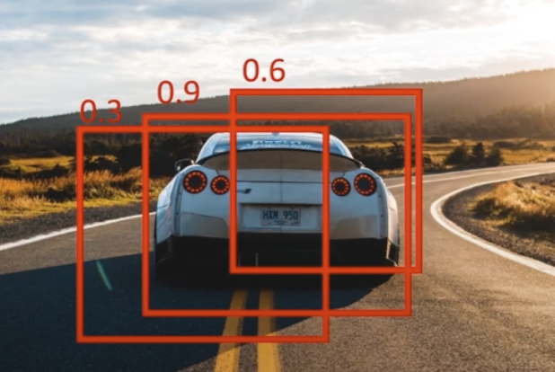
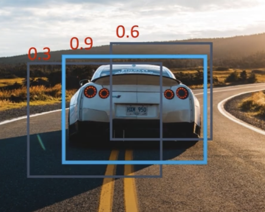
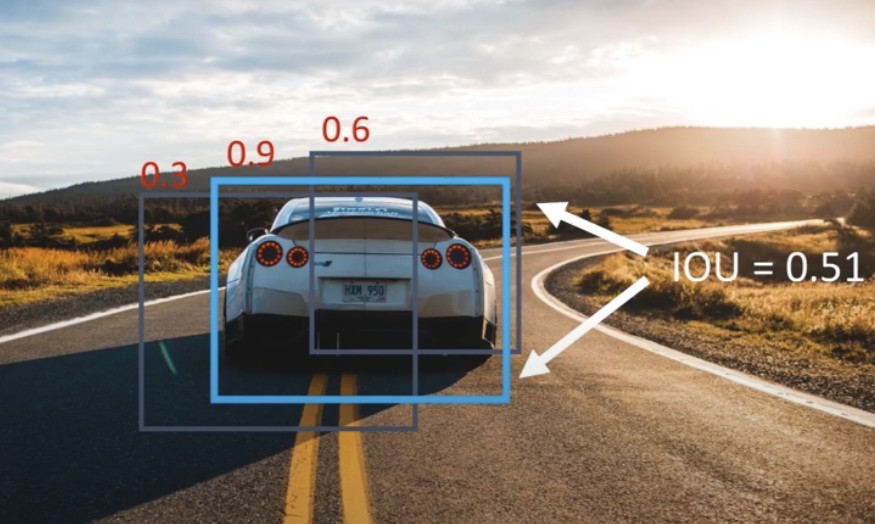

# Non-max Suppression

- **Prerequisites**
    - [IoU](./intersection_over_union.md).

    * **NMS** is used to remove redundant bounding boxes after predictions are made.
    * **IOU_threshold** is a float value [0-1]. We use it when comparing bounding boxes, if the IoU result is greater than IOU_threshold than the box with the lower confidence score is removed. Note: the higher than IoU the more the boxes overlap.

- [NMS Code implementation](../../../object_detection/yolo_v1_orig/utils/nms.py)

**Before:** NMS.  

**After:** NMS.  

## Steps of NMS

- **Note**: If we have image classes example ['dog', 'cat', etc..], then we need to compute NMS for each class separately. So if a dog and a cat bounding box overlap we don't perform NMS on them.

1. **Filter by Confidence:** First, discard all predicted bounding boxes with a confidence score less than a confidence_threshold (e.g., 0.25).

2. **Sort Boxes:** Sort the remaining bounding boxes for a given class in descending order based on their confidence scores.

3. **Iterate and Suppress:** Loop through the sorted boxes to find the best ones.

    - Start with the bounding box that has the highest confidence score. This box is kept.

    - Calculate the IoU between this highest-scoring box and all other boxes in the list.

    - Remove (suppress) any bounding boxes that have an IoU greater than the iou_threshold with the current highest-scoring box.

    - After this, move to the next highest-scoring box that has not been suppressed. Repeat the process until all boxes have been either kept or suppressed.

## Example:   
1. Three predicted bounding boxes.

    

    - Each of bounding box has a probability score [0.3, 0.9, 0.6]. The probability is between [0-1] and it indicates how likely that there is an object in that bounding box.
     - Sort to [0.9, 0.6, 0.3].

2. We get the bounding box with the highest (pc) which in this case is the one with a (0.9) probability.  

    

3. Then we compare it with the other boxes that have a lower probability, and we calculate the IoU between them.

    

    1. Example: IoU between box (0.9) vs box (0.6) = 0.51.
        1. If the result (0.51) is greater than an IOU_threshold ex:0.5 then we remove the box with the lower confidence score (0.6).

    2. Then we compare box (0.9) and box (0.3) = 0.6.
        1. If the result is less than the IOU_threshold ex:0.5, the box with the lower confidence score is not suppressed by the current highest confidence box.

