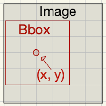
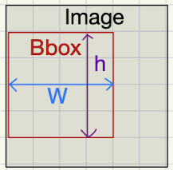
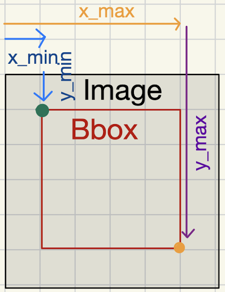
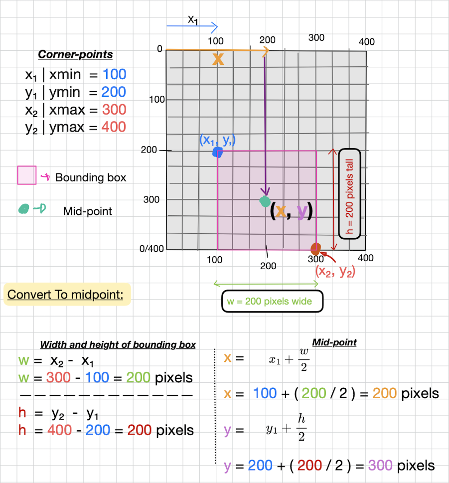

# Understanding Bounding Box Coordinate Formats

💡 The two primary coordinate formats of bounding boxes (bbox) are: **mid-point** and **corner-points**.

### Vocab:

**Absolute pixel values:** The coordinate values of bounding boxes are in pixel measurements. Fixed to image resolution *e.g. x = 10 pixels; Doesn't resize well.*

**Percentage values (Normalized):** The coordinate values of bounding boxes are in percentages normalized (0-1 scale) of the image dimensions *e.g. x = 0.10; Scales automatically with image resizing.*

- Normalization is Better for Training: It's common practice to work with normalized values (0-1) during training. This keeps the values in a consistent range, which helps with model stability and convergence, ensuring the model is not sensitive to the input image size. A model trained on 512x512 images with absolute coordinates would not generalize well to 1024x1024 images, but with normalized coordinates, the same bounding box values work for any image size.

Both **mid-points** and **corner-points** can have values of either absolute values or normalized values. *Certain scenarios* require them to be in one or the other. But for the most part -> Deep Learning Models when training (Input/Output): Normalized values are overwhelmingly preferred for both mid-point and corner-point formats. In cases like plotting bounding boxes its easier to use absolute values.

### Mid-point format: `(x, y, w, h)`  

* The `x`, `y` represent the (mid/center) point of the bounding box. 
- *Note:* Certain models like YOLOv1 use a hybrid mid-point where the (x, y) are normalized relative to a grid-cell.

    
* `w` and `h` represent the width and height of the bounding box.

    

### Corner-points format: `(x_min, y_min, x_max, y_max)`  

* Can also be noted as `(x₁, y₁, x₂, y₂)`.
* `x_min`, `y_min` represents the top-left corner of the bounding box where (0, 0) is the top-left corner of the image.  

* `x_max`, `y_max` represent the bottom-right corner.  

    
* These coordinates are typically relative to the **entire image**.
* Corner-points is often used during postprocessing steps such as **IoU calculation**, **visualization**, and **Non-Max-Suppression**.

### Easily Resize-able

* It does not matter whether the bounding box coordinates are represented as **corner-points** (x₁, y₁, x₂, y₂) or **mid-points** (x, y, w, h) as long as they are expressed as **percentages** (normalized values between 0 and 1) and relative to the entire image dimensions you can resize any image without having to worry about messing up the bounding box coordinates.

### How To Convert Between Formats

***Note:** Examples converts from corner-points (absolute pixel values) to mid-points (absolute pixel values), but the same conversion formulas apply for both absolute pixel values and normalized coordinates.*

**Corner-points to midpoints: ↓**

---

 

**Conversion formulas:**

<u>Corner-points to Mid-points:</u>
- $x = x_{min} + (width/2)$
- $y = y_{min} + (height / 2)$
- $width = x_{max} - x_{min}$
- $height = y_{max} - y_{min}$

<u>Mid-points to Corner-points:</u>

- $x_{min} = x - (width / 2)$
- $y_{min} = y - (height / 2)$
- $x_{max} = x + (width / 2)$
- $y_{max} = y + (height / 2)$

