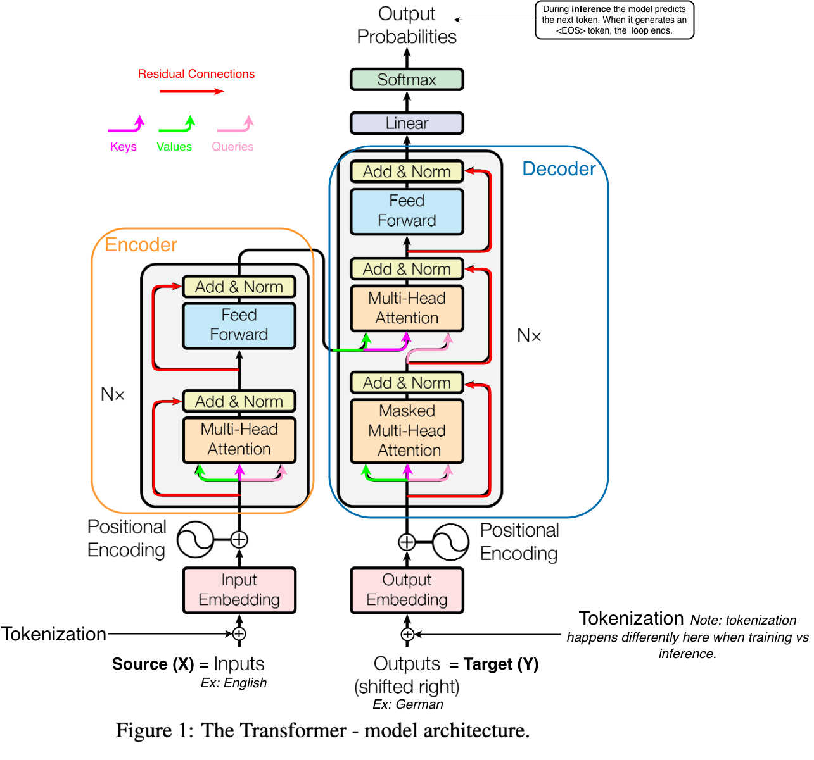

# Implement The Transformer Model From The OG Paper

- Paper → [Attention Is All You Need](https://arxiv.org/pdf/1706.03762)

Useful Resources:

- [Transformers Step-by-Step Explained by ByteByteGo](https://www.youtube.com/watch?v=avjX3QrYkls)
- [The Illustrated Transformer](https://jalammar.github.io/illustrated-transformer/)

---

**TODO:**

- Training
  - Make sure all tensors are on GPU
- Inference
  - Make sure all tensors are on GPU
- Calculate **BLEU** scores

- If I create the jupyter library implement it here.

---

💡 The transformer architecture is used in many SOTA models that need to process sequential data. It can be reconfigured to perform a lot of different tasks other than just Naturel Language Processing.

- ✨ All the components are implemented in there own notebooks in [./model](./model/).

- **Terminology**:
  - The **Encoder** contains a **Nx** stack of **EncoderLayers**
    - Inside a single **EncoderLayer** there are two main components (or **sublayers**.
      - The first is the **Multi-Head Attention** and its (Add & norm).
      - The second is the **Feed Forward** (FFN) and its (Add & norm).
    - This goes for the decoder as well, except it has an additional **sublayer**, the **Masked Multi-Head Attention**.
    - **Source (X)** the Encoder's input, if we were training the model to translate english to german, the source would be the english tokens.
    - **Target (Y)** the Decoder's input. Note, the connection between the Encoder and Decoder the Source is being passed! Target is being feed to the Decoder where the Outputs are (shifted right). This would be the german tokens.
      - You can think of the Decoder as: It consumes its own previous output (target) while simultaneously cross-referencing the source.
    - **Model size** = d_model = $d_{model}$
