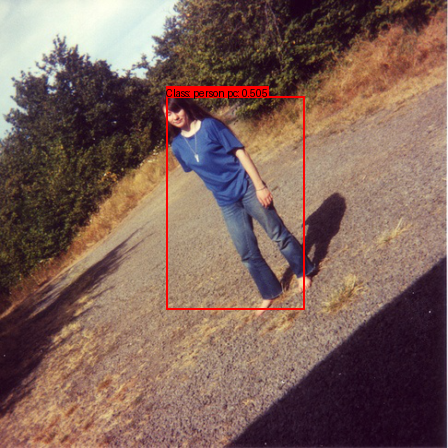
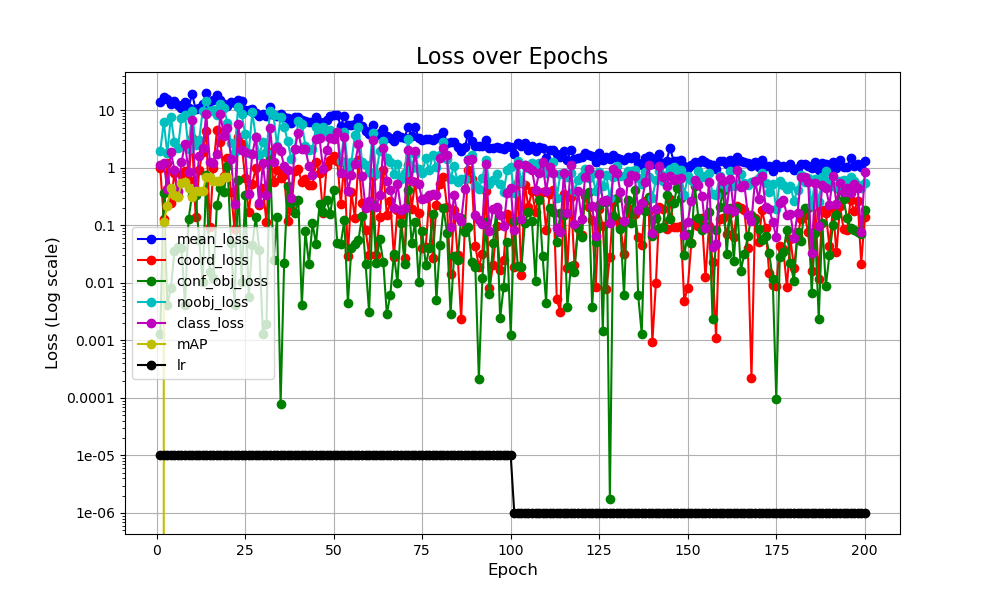

# YOLO V1 Implementation
<!-- TODO make sure it works after downloading from github-->

🚨 I could not find any YOLOv1 pre-trained models, even from [Joseph Chet Redmon's site](https://pjreddie.com)

- The paper's model was pre-trained on ImageNet: They took the convolutional layers of their network and trained them on the massive ImageNet dataset (1,281,167 training images, 50,000 validation images and 100,000 test images) for a **week**  (Work-around use VGG16 backbone).

- Parts that could have been coded better:

    - Make every function that expects bounding boxes in a certain format (mid-point or corner-points) | (normalized or absolute values), validate that the input is the required format.

---

Goal: Identify objects in images.

<div style="display: flex; flex-wrap: wrap; justify-content: center; align-items: center; padding: 0.2em; background-color: #f3f4f6; border-radius: 1rem; box-shadow: 0 4px 6px -1px rgba(0, 0, 0, 0.1);">



</div>


🔗 [YOLO v1 Paper](https://arxiv.org/pdf/1506.02640)

⭐️ **Objective From Paper**: "Using our system, You-Only-Look-Once (YOLO) at an image to predict what objects are present and where they are."

⭐️ **Note**: I'm aiming for direct adherence to the paper's approach with slight improvements.

⭐️ Ran on *Mac-os silicon*, haven't tested on other OSs.


## Prerequisites

- Torch version: 2.7
- Conda version: 24.11.1
- Knowledge:
    - [YOLO v1 resources](https://github.com/t20e/res/tree/main/coding.res/AI.res/object_detection)
    - [Firm Understanding of Coordinate formats](https://github.com/t20e/res/blob/main/coding.res/AI.res/object_detection/understand_corner_and_mid_points.md)
    - [Intersection Over Union](https://github.com/t20e/res/blob/main/coding.res/AI.res/object_detection/YOLO_v1.res/intersection_over_union.md)


## How To Run

**Setup Project**  -> Create the environment, optionally download the **VOCDataset**, and structure the project.

- 🚨 Note: The VOC Dataset is very large (~4GB). The main goal with this repo is to overfit to a number of images which is included, however, if you want to download and train on the entire dataset then add `--download_VOC` flag to `python setup.py`

    - If any errors occur when downloading the dataset; then manually download it from [kaggle link](#Dataset_link) -> rename the zip file to: `VOC_dataset.zip` and add the zip file to `data/datasets` and run `python setup.py` again. VOC tree will look like this [VOCDataset tree](#Dataset_tree_link).

1. Create a conda environment.
```shell 
    conda env create -f configs/environment.yaml
```

2. Activate the conda environment.
```shell 
    conda activate yolov1_env
```

3. Setup project.
```shell
    python setup.py # --download_VOC
```

4. Overfit test: 
    - Note: If youn don't have a GPU available, you can use your CPU for the overfitting (runs just as fast) -> change these lines -> [3. Stack and move the entire dataset to the GPU](utils/load_small_samples_to_GPU.py) to -> .to("cpu") 
    1. Make configurations edits in [config](configs/config_voc_dataset.yaml).
        - Set
            - OVERFIT = True
            - USE_PRE_TRAIN_BACKBONE -> Set to True or False
                - Whether to replace YOLOv1 CNN backbone with a pre-trained VGG16 backbone.
    2. Train model:
    ```shell
        caffeinate -d python main.py
    ```
    3. Plot on those same images.
        - Add the trained model's filename to LOAD_MODEL_FILENAME in [config](configs/config_voc_dataset.yaml).
    - Plot in [notebooks/test-plot-model-predictions.ipynb](notebooks/test-plot-model-predictions.ipynb)

## Vocab

- annotations = labels  
- LABEL_NODES = *The total number of nodes that a label tensor has for one image.*
- CELL_NODES = *The number of nodes that a single cell tensor has.*

## Dataset <span id="Dataset_link"><span>


🔗 [VOC Dataset Publisher](http://host.robots.ox.ac.uk/pascal/VOC/voc2012)

🔗 [Download VOC 2012 Dataset](https://www.kaggle.com/datasets/gopalbhattrai/pascal-voc-2012-dataset/data)  


Classes: (num=20)  
*Class_names=index*

|                           |                    |                    |                 |                  |
|---------------------------|--------------------|--------------------|-----------------|------------------|
|       'person'=0            |       'bird'=1       |         'cat'=2      |     'cow'=3       |     'dog'=4        |
|       'horse'=5             |       'sheep'=6      |      'aeroplane'=7   |   'bicycle'=8     |     'boat'=9       |
|       'bus'=10               |       'car'=11        |      'motorbike'=12   |    'train'=13      |    'bottle'=14      |
|       'chair'=15             |    'diningtable'=16  |    'pottedplant'=17  |     'sofa'=18      |   'tvmonitor'=19   | 


**Note:** The VOC dataset comes with object parts for example: human objects can also be divided into parts like 'head', 'hand', and 'foot' but for this project we will only grab the main objects bbox e.g. "person".


## How To Structure Dataset


### Understanding Bounding Box Coordi**corner-points** with Absolute nate Formats


⭐️ If you don't know the difference between corner-points and mid-points [Please read](https://github.com/t20e/res/blob/main/coding.res/AI.res/object_detection/understand_corner_and_mid_points.md).

**Bounding Box Coordinate Format Nodes For Yolov1:**

- When **training** and **predicting** we use hybrid **mid-points** with normalized values [0-1]:
    - The (x, y) which represent the bounding boxes midpoint/center-point in a grid-cell are relative to that grid-cell.
    - The (w, h) which represent the width and height of a bounding box are relative to the image.
    - This allows for more stable numerical computations because the values are between [0-1].

- When computing **IoU** and **NMS** we use **corner-points** with Absolute or normalized values.
- When **Plotting** we use **corner-points** with Absolute values.

- The **VOC dataset** for this project is labeled in **corner-points** coordinates, we will convert it to **mid-points** when neededb.*


### Dataset Pipeline

From paper: "Each bounding box consists of 5 predictions: x, y, w, h, and confidence. The (x,y) coordinates represent the center of the box relative to the bounds of the grid cell. The width and height are predicted relative to the whole image".

* So when we format the dataset we need to make sure the (x, y) labels be relative to the size of a grid cell instead of being relative to the image. 
* **Why do only the (x, y) coordinates have to be relative to a grid cell but (w, h) don't?** The x and y is the center-point of the bounding box located in a cell. This means that the (x, y) values can't be bigger than one, if they were than the bboxes mid-point is located outside the cell that should have predicted it, however the (w, h) represent the size of the bounding box which can be bigger than a single grid cell.  
        <div class="ref_i">
            Example: 
            
        </div>

*How many grid cells on an image?*  
**S** = 7 |  *split_size. 7x7=49 total cells.*  
*How many boxes does the model predict for each grid cell?*  
**B** = 2  
*How many classes in the dataset.*  
**C** = 20 

<div class="ref_i">  
    A single cell's tensor ->
      
</div>  

- **pc₁** and **pc₂** represent the **confidence score** or **objectness scores** (probability that an object exists in the bbox).

- We make the tensors for the **label** and the model's **output** the same *shape*.
- For the **label** bounding boxes.
    - Only the first bounding box *(pc<sub>1</sub>, x<sub>1</sub>, y<sub>1</sub>, w<sub>1</sub>, h<sub>1</sub>)* is used, the second bounding box is filled with zeros. Only the **output** uses both bboxes, where the model outputs two predicted bounding boxes per cell and selects the better one.  
    * Any grid cells that contains a bounding boxes mid-point.
        - we set **pc₁** and **class_idx** to 1.
            - **class_idx** refers to the index within the initial 20 class nodes, establishing a one-to-one correspondence with the *Class_names* array. So, if class_idx is 1, it indicates cell[1] is 1, and its associated class name in Class_names[1] is 'bird'. For the output we argmax() the first 20 nodes to get the object with the highest prediction score.
        - Add the bbox coordinates to position of box1 for that cell.  
- Nodes meaning values in a tensors ⬇️.
- **CELL_NODES** = <i>( 20(class scores) + 5 (bbox<sub>1</sub>) + 5 (bbox<sub>2</sub>) )</i> = **30** = <i>(C + B * 5)</i>
- **LABEL_NODES** 
    - <i> S * S * (C + B * 5)</i> = **1,470**
    - <i> Total nodes per cell * S * S </i> = **1,470**


### YOLO v1 Architecture


This architecture is a sequence of convolution and max pooling layers used to process input images into high-level feature maps. 

**C:** = 20 *num of classes in the dataset*.  
**B:** = 2 *num of bboxes that each cell predicts*.  
**S:** = 7 *split_size, how many cells we are splitting the image into, 7x7=49*.  
**CELL_NODES**: = 30 *= B × 5 + C*.

- All maxpooling layers will have  a kernel_size=2 stride=2.

1. (kernel: 7x7 , filters: 64, stride: 2 , padding: 3) - Conv layer. **Note:** the padding: 3 is on the diagram 448x448x3 (first layer/box), and the kernel: 7x7; the 7 here doesn't correlate to S.
2. *Max pool*
3. (kernel: 3x3, filters: 192, stride: 1, padding: 1) - Conv layer
4. *Max pool*
5. (kernel: 1x1, filters: 128, stride: 1, padding: 0) - Conv layer
6. (kernel: 3x3, filters: 256, stride: 1, padding: 1) - Conv layer
7. (kernel: 1x1, filters: 256, stride: 1, padding: 0) - Conv layer
8. (kernel: 3x3, filters: 512, stride: 1, padding: 1) - Conv layer
9. *Max pool*
10. **Repeat layers 4 times**
    - (kernel: 1x1, filters: 256, stride: 1, padding: 0) - Conv layer
    - (kernel: 3x3, filters: 512, stride: 1, padding: 1) - Conv layer
11. (kernel: 1x1, filters: 512, stride: 1, padding: 0) - Conv layer
12. (kernel: 3x3, filters: 1024, stride: 1, padding: 1) - Conv layer
13. *Max pool*
14. **Repeat layers 2 times**
    - (kernel: 1x1, filters: 512, stride: 1, padding: 0) - Conv layer
    - (kernel: 3x3, filters: 1024, stride: 1, padding: 1) - Conv layer
15. (kernel: 3x3, filters: 1024, stride: 1, padding: 1) - Conv layer
16. (kernel: 3x3, filters: 1024, stride: 2, padding: 1) - Conv layer
17. (kernel: 3x3, filters: 1024, stride: 1, padding: 1) - Conv layer
18. (kernel: 3x3, filters: 1024, stride: 1, padding: 1) - Conv layer
19. Feeding thru fully connected layers.
    - The tensor output from step 18 is of shape (7x7x1024).
    - Flatten it to get a 1D vector --> 7x7x1024= 50176.
    - Pass thru the first FC (fully connected layer) which has 4096 neurons.
        - Activation function: likely Leaky ReLU
    - Pass thru second FC, this FC will output a shape of S × S × (B × 5 + C) 
        - Note: "× 5" here is for the nodes of a  single bbox, we multiply it by the B to get the total number of bounding box per cell.
        - Final output size S × S × (B × 5 + C) = S × S × CELL_NODES = 1470
        - Reshape output -> S x S x CELL_NODES to extract predictions.
20. Once we have output, we need to apply [Non Max Suppression](https://github.com/t20e/res/blob/main/coding.res/AI.res/object_detection/YOLO_v1.res/non-max-suppression.md) to remove redundant bounding boxes.
21. Plot

### Loss Function

**Check out:**

- [Loss Function Notes](https://github.com/t20e/res/blob/main/coding.res/AI.res/object_detection/YOLO_v1.res/loss_fn.md).

- [Loss Function implemented](https://github.com/t20e/AI_public_projects/blob/main/object_detection/yolo_v1_orig/model/loss.py).

- Note we use [Mean Average Precision](https://github.com/t20e/res/blob/main/coding.res/AI.res/object_detection/YOLO_v1.res/mean_average_percision.md) during training to test how well the model performs on Validation dataset.

-----------------------

## Misc

**VOCDataset Tree:**   <span id="Dataset_tree_link"><span>

    datasets
    └── VOC_2012_dataset
        ├── test
        │   ├── Annotations
        │   ├── ImageSets
        │   │   ├── Action
        │   │   ├── Layout
        │   │   ├── Main
        │   │   └── Segmentation
        │   └── JPEGImages
        ├── train
        │   ├── Annotations (~13,700 items)
        │   ├── ImageSets
        │   │   ├── Action
        │   │   ├── Layout
        │   │   ├── Main
        │   │   └── Segmentation
        │   ├── JPEGImages
        │   ├── SegmentationClass
        │   └── SegmentationObject
        └── val
            ├── Annotations (~3425 items)
            └── JPEGImages


-----------------------

<!-- STYLES -->

<style>
    /* body {
        background-color: linen;
    } */

    .ref_i {

    }

    img {
        margin-left: auto;
        margin-right: auto;
    }

    .ref_i {
        display: flex; 
        align-items: center;
        width: 100%;
    }
</style>