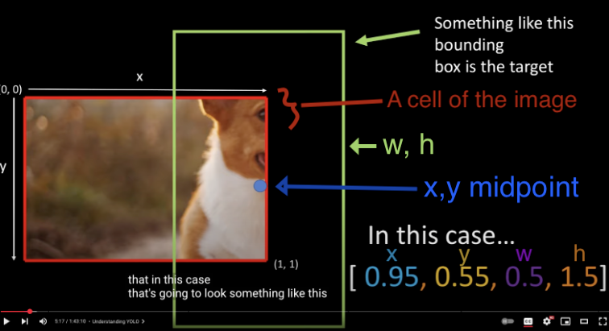
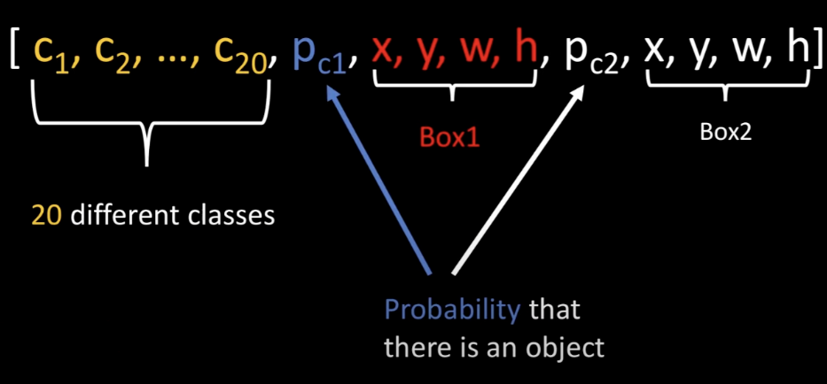
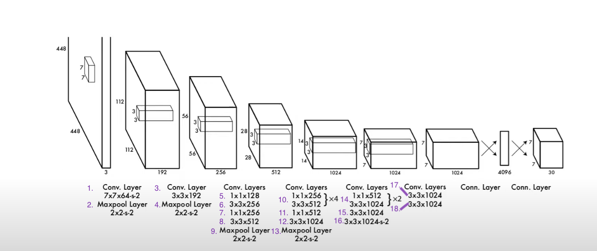

# Yolo V1 from paper

🔗 [YOLO v1 Paper]("https://arxiv.org/pdf/1506.02640")

⭐️ **Objective**: "Using our system, you only look once (YOLO) at an image to predict what objects are present and where they are."

⭐️ **Note**: I'm aiming for direct adherence to the paper's approach, so the code's design will favor easy comprehension, even if it means less vectorization and therefore reduced efficiency.

## Prerequisites

torch version: 2.7    
conda version: 24.11.1


## How To Run 

1. Setup Project  -> Create the environment, and download the dataset.
```bash 
bash setup.bs
```
2. Activate Conda Environment
```bash 
conda activate yolov1_env
```
3. Train Model
<!-- TODO -->
```bash 
python train.py
```
4. RUN 
<!-- TODO maybe live model or other -->

## Vocab

- annotations = labels  
- LABEL_NODES = *The total number of nodes that a label tensor has for one image.*
- CELL_NODES = *The number of nodes that a single cell tensor has.*

## Dataset

🔗 [VOC 2012](https://www.kaggle.com/datasets/gopalbhattrai/pascal-voc-2012-dataset/data)  


🔗 [VOC 2012 G.G publisher](http://host.robots.ox.ac.uk/pascal/VOC/voc2012)


Classes: (num=20)  
*Class_names:*
|                           |                    |                    |                 |                  |
|---------------------------|--------------------|--------------------|-----------------|------------------|
|       'person'            |       'bird'       |         'cat'      |     'cow'       |     'dog'        |
|       'horse'             |       'sheep'      |      'aeroplane'   |   'bicycle'     |     'boat'       |
|       'bus'               |       'car'        |      'motorbike'   |    'train'      |    'bottle'      |
|       'chair'             |    'dining table'  |    'potted plant'  |     'sofa'      |   'tvmonitor'   | 

*-'tvmonitor' should be 'tv/moniter' but the annotated data has it as 'tvmoniter'.*


**Note:** The VOC dataset comes with object parts for example: human objects can also be divided into parts like 'head', 'hand', and 'foot' but for this project we will only grab the main objects bbox.

<!-- TODO once model predicts correctly on one image add the image with bboxes here -->


## How To Structure Dataset


### Understanding Bounding Box Coordi**corner-points** with Absolute nate Formats


⭐️ If you don't know the difference between corner-points and mid-points [Please read](https://github.com/t20e/res/blob/main/coding.res/AI.res/object_detection/understand_corner_and_mid_points.md).

**Coordinate Format Nodes For Yolov1:**

- When **training** and **predicting** we use **mid-points** with normalized values. This allows for more stable numerical computations because the values are between [0-1].

- When computing **IoU** and **NMS** we use **corner-points** with Absolute or normalized values.
- When **Plotting** we use **corner-points** with Absolute values.

- The **VOC dataset** for this project is labeled in **corner-points** coordinates, we will convert it to **mid-points** when needed to train the model.*

* For certain architectures like *YOLOv1* the `x` and `y` coords will need to be **relative to the grid cell** that contains the object.
    - That means `x`, `y` are in the range `[0, 1]`, where `(0,0)` is the top-left of the cell and `(1,1)` is the bottom-right of the same cell. *The values of x, y can't be bigger than 1.*

* `w` and `h` represent the width and height of the bounding box, **relative to the entire image**. *Unlike the x and y, the values of w and h can be bigger than 1.*


### Dataset Pipeline


From paper: "Each bounding box consists of 5 predictions: x, y, w, h, and confidence. The (x,y) coordinates represent the center of the box relative to the bounds of the grid cell. The width and height are predicted relative to the whole image".

* So when we format the dataset we need to make sure the (x, y) labels be relative to the size of a grid cell instead of being relative to the image. Normally datasets have the (x,y,w,h)  coordinates of labeled bounding boxes as percentages of the image, this allows you to resize the images without messing up the the bounding box coordinates.
* **Why do only the (x, y) coordinates have to be relative to a grid cell but (w, h) don't?** The x and y is the center-point of the bounding box located in a cell. This means that the (x, y) values can't be bigger than one, if they were than the bboxes mid-point is located outside the cell that should have predicted it, however the (w, h) represent the size of the bounding box which can be bigger than a single grid cell.  
        <div class="ref_i">
            Example: 
            
        </div>

*How many grid cells on an image?*  
**S** = 7 |  *split_size. 7x7=49 total cells.*  
*How many boxes does the model predict for each grid cell?*  
**B** = 2  
*How many classes in the dataset.*  
**C** = 20 

<div class="ref_i">  
    A single cell's tensor ->
      
</div>  

- **pc₁** and **pc₂** represent the **confidence score** or **objectness scores** (probability that an object exists in the bbox).

- We make the tensors for the **label** and the model's **output** the same *shape*.
- For the **label** bounding boxes.
    - Only the first bounding box *(pc<sub>1</sub>, x<sub>1</sub>, y<sub>1</sub>, w<sub>1</sub>, h<sub>1</sub>)* is used, the second bounding box is filled with zeros. Only the **output** uses both bboxes, where the model outputs two predicted bounding boxes per cell and selects the better one.  
    * Any grid cells that contains a bounding boxes mid-point.
        - we set **pc₁** and **class_idx** to 1.
            - **class_idx** refers to the index within the initial 20 class nodes, establishing a one-to-one correspondence with the *Class_names* array. So, if class_idx is 1, it indicates cell[1] is 1, and its associated class name in Class_names[1] is 'bird'. For the output we argmax() the first 20 nodes to get the object with the highest prediction score.
        - Add the bbox coordinates to position of box1 for that cell.  
- Nodes meaning values in a tensors ⬇️.
- **CELL_NODES** = <i>( 20(class scores) + 5 (bbox<sub>1</sub>) + 5 (bbox<sub>2</sub>) )</i> = **30** = <i>(C + B * 5)</i>
- **LABEL_NODES** 
    - <i> S * S * (C + B * 5)</i> = **1,470**
    - <i> Total nodes per cell * S * S </i> = **1,470**


### YOLO v1 Architecture



This architecture is a sequence of convolution and max pooling layers used to process input images into high-level feature maps. 

**C:** = 20 *num of classes in the dataset*.  
**B:** = 2 *num of bboxes that each cell predicts*.  
**S:** = 7 *split_size, how many cells we are splitting the image into, 7x7=49*.  
num_cells_per_cell: = 30 *= B × 5 + C*.   


1. (kernel: 7x7 , filters: 64, stride: 2 , padding: 3) - Conv layer. **Note:** the padding: 3 is on the diagram 448x448x3 (first layer/box), and the kernel: 7x7; the 7 here doesn't correlate to S.
2. *Max pool*
3. (kernel: 3x3, filters: 192, stride: 1, padding: 1) - Conv layer
4. *Max pool*
5. (kernel: 1x1, filters: 128, stride: 1, padding: 0) - Conv layer
6. (kernel: 3x3, filters: 256, stride: 1, padding: 1) - Conv layer
7. (kernel: 1x1, filters: 256, stride: 1, padding: 0) - Conv layer
8. (kernel: 3x3, filters: 512, stride: 1, padding: 1) - Conv layer
9. *Max pool*
10. **Repeat layers 4 times**
    - (kernel: 1x1, filters: 256, stride: 1, padding: 0) - Conv layer
    - (kernel: 3x3, filters: 512, stride: 1, padding: 1) - Conv layer
11. (kernel: 1x1, filters: 512, stride: 1, padding: 0) - Conv layer
12. (kernel: 3x3, filters: 1024, stride: 1, padding: 1) - Conv layer
13. *Max pool*
14. **Repeat layers 2 times**
    - (kernel: 1x1, filters: 512, stride: 1, padding: 0) - Conv layer
    - (kernel: 3x3, filters: 1024, stride: 1, padding: 1) - Conv layer
15. (kernel: 3x3, filters: 1024, stride: 1, padding: 1) - Conv layer
16. (kernel: 3x3, filters: 1024, stride: 2, padding: 1) - Conv layer
17. (kernel: 3x3, filters: 1024, stride: 1, padding: 1) - Conv layer
18. (kernel: 3x3, filters: 1024, stride: 1, padding: 1) - Conv layer
19. Feeding thru fully connected layers.
    - The output from 18. is shape (7x7x1024).
    - flatten output to get a 1D vector --> 7x7x1024= 50176.
    - Pass thru the first FC (fully connected layer) which has 4096 neurons.
        - Activation function: likely Leaky ReLU
    - Pass thru second FC, this FC will output a shape of S × S × (B × 5 + C) 
        - Note: "× 5" here is for the nodes of a  single bbox, we multiply it by the B to get the total number of bounding box per cell.
        - Final output size S × S × (B × 5 + C) = S × S × num_cells_per_cell = 1470
        - Reshape output -> S x S x num_cells_per_cell to extract predictions.
            - each cell contains 30(num_cells_per_cell) -> 20 class predictions + 5(bbox) * B

### Loss Function

**Check out:**
- [res repo loss function notes](https://github.com/t20e/res/blob/main/coding.res/AI.res/object_detection/YOLO.res/loss_fn.ipynb)  
- And this project's loss function.


<!-- STYLES -->

<style>
    /* body {
        background-color: linen;
    } */

    .ref_i {

    }

    img {
        margin-left: auto;
        margin-right: auto;
    }

    .ref_i {
        display: flex; 
        align-items: center;
        width: 100%;
    }
</style>