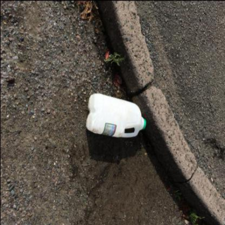
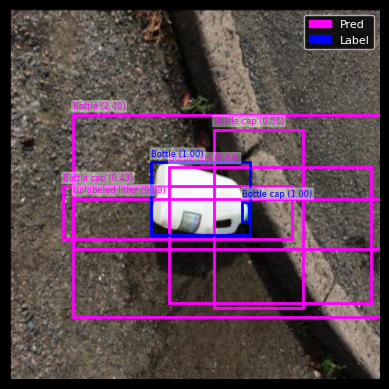
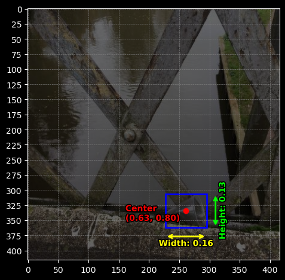
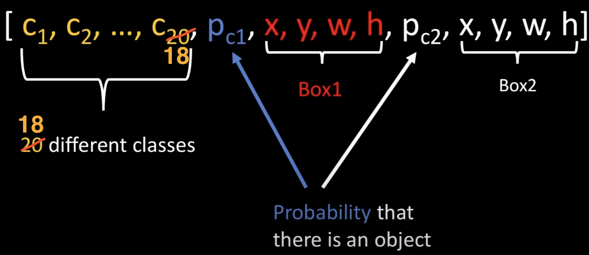
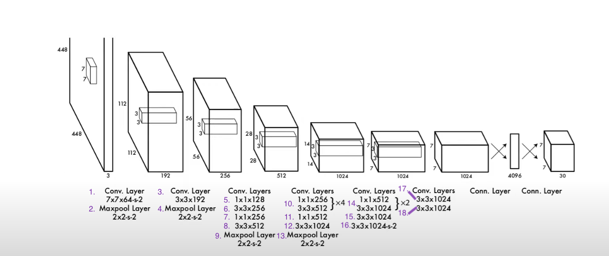

# YOLO V1 TACO

* The TACO (Trash Annotations in Context)

* Objective:

  * Identify and classify littered trash from photos.
  * Make the code DRY and efficient only use for-loops where absolutely necessary and vectorize all computations.

  
  

**How to run:**  
    1. Train models with main.py.  
    2. Use **inference.ipynb** to test the models. Be sure to update **config.yaml** with your models name, and other attributes.

## Prerequisites

torch version: 2.6.0

<pre style="font-size:.7em">
Data folder structure:
root/  
└── data/  
    ├── train/  
    │   ├── images/  
    │   ├── labels/  
    │   └── train.csv  
    ├── test/  
    └── valid/  
</pre>

## Understanding Bounding Box Coordinate Formats in YOLOv1

There are two types of bounding box (bbox) coordinate formats: **mid-point** and **corner-points**.

### Mid-point format: `(x, y, w, h)`  

* `x`, `y` represent the center point of the bounding box.  

* In **YOLOv1**, `x` and `y` are relative to the **grid cell** that predicts the object.  
  That means `x`, `y` are in the range `[0, 1]`, where `(0,0)` is the top-left of the cell and `(1,1)` is the bottom-right of the same cell.  
* `w` and `h` represent the width and height of the bounding box, **relative to the entire image**.

### Corner-points format: `(x_min, y_min, x_max, y_max)`  

* `x_min`, `y_min` represent the top-left corner of the bounding box.  

* `x_max`, `y_max` represent the bottom-right corner.  
* These coordinates are typically relative to the **entire image**, and are often derived from mid-point format during postprocessing steps such as **IoU calculation**, **visualization**, or **Non-Max-Suppression**.

**YOLOv1** uses mid-point format for its predictions, however it's simpler to use corner-points for NMS and IOU calculations. They are easily convertible.

## Dataset

<a href="https://www.kaggle.com/datasets/vencerlanz09/taco-dataset-yolo-format">Dataset Link</a>

Classes (num=18)

|          |           |           |
|------------------------|--------------------|------------------|
| Aluminum foil          | Bottle           | Bottle cap           |
| Broken glass           | Can                | Carton           |
| Cigarette              | Cup                | Lid              |
| Other litter           | Other plastic      | Paper            |
| Plastic bag - wrapper  | Plastic container  | Pop tab          |
| Straw                  | Styrofoam piece    | Unlabeled litter |

  
  

This image's labeled class object and its bounding boxes:
<table border="1">
    <tr>
        <td>Class</td>
        <td>X</td>
        <td>Y</td>
        <td>Width</td>
        <td>Height</td>
    </tr>
    <tr>
        <td>7 = cup</td>
        <td>0.6274038461538461</td>
        <td>0.8028846153846154</td>
        <td>0.16346153846153846</td>
        <td>0.13341346153846154</td>
    </tr>
</table>

* The **X** and **Y** values are the coordinates of the **mid-point** of the bounding box **relative** to the entire image, later we will **process** the dataset and make the **X** and **Y** coordinates **relative** to the **cell** its in.  

  X coord= 63%, img_width  = 416p, 63% of 416p = **262 pixels**.  
  Y coord= 80%, img_height = 416p, 80% of 416p = **333 pixels**.  
  X,Y location is at 262 x 333 pixels on the image.  

* The **weight** and **height** are fractions of full image width/height and represent the size of that bounding box compared to the entire image.

  W coord = 16%, img_width = 416p, 16% of 416p = **67 pixels**.  
  H coord = 13%, img_height = 416p, 13% of 416p = **54 pixels**.  
  The bounding boxes width is 67 pixels long and 54 pixels tall.

**Notes from the dataset publisher:**    
The dataset includes 6004 images. Litter bounding boxes are annotated in YOLOv8 format.

The following pre-processing was applied to each image:

* Auto-orientation of pixel data (with EXIF-orientation stripping)
* Resize to 416x416 (Stretch)

The following augmentation was applied to create 2 versions of each source image:

* 50% probability of horizontal flip
* 50% probability of vertical flip
* Equal probability of one of the following 90-degree rotations: none, clockwise, upside-down

train: contains 4200 images  
val: contains 1704 images  
test: contains 100 images  

## How To Structure Dataset To Train Model

From paper: "Each bounding box consists of 5 predictions: x, y, w, h, and confidence. The (x,y) coordinates represent the center of the box relative to the bounds of the grid cell. The width and height are predicted relative to the whole image".

**S** = 7 |  <i>split_size. 7x7=49 total cells.</i>  
**B** = 2 | <i>The number of bounding boxes the model predicts for each cell.</i>  
**C** = 18 | <i> The number of classes in the dataset, in the paper they had 20 classes.</i>  

### How Are Dateset Tensors structured

* Structuring is done in ./yolov1/dataset.py

A tensor representing a single cell is structured as:  
**[18 class_nodes, pc1, x1, y1, w1, h1, pc2, x2, y2, w2, h2]**  
*(Total nodes per cell: 18 (class scores) + 5 (bbox1) + 5 (bbox2) = 28)*

**Note:**  
For the **label**, only the first bounding box *(pc1, x1, y1, w1, h1)* is used. The second bounding box is filled with zeros and is only used during **prediction**, where the model outputs two bounding boxes per cell and selects the better one.

- **pc1** and **pc2** represent the **objectness scores** (probability that an object exists in the bbox).

To get the **total number of nodes that each label** has for one image.

* S * S * (C + B * 5) --> 7 * 7 * (18 + 2 * 5) = 1,372
* Also  7x7=49 -> 49*28 = 1,372

### YOLO v1 Architecture

This architecture is a sequence of convolution and max pooling layers used to process input images into high-level feature maps. 

1. (kernel: 7x7 , filters: 64, stride: 2 , padding: 3) - Conv layer. **Note:** the padding: 3 is on the diagram 448x448x3 (first layer/box).
2. *Max pool*
3. (kernel: 3x3, filters: 192, stride: 1, padding: 1) - Conv layer
4. *Max pool*
5. (kernel: 1x1, filters: 128, stride: 1, padding: 0)
6. (kernel: 3x3, filters: 256, stride: 1, padding: 1)
7. (kernel: 1x1, filters: 256, stride: 1, padding: 0)
8. (kernel: 3x3, filters: 512, stride: 1, padding: 1)
9. *Max pool*
10. **Repeat layers 4 times**
    - (kernel: 1x1, filters: 256, stride: 1, padding: 0)
    - (kernel: 3x3, filters: 512, stride: 1, padding: 1)
11. (kernel: 1x1, filters: 512, stride: 1, padding: 0)
12. (kernel: 3x3, filters: 1024, stride: 1, padding: 1)
13. *Max pool*
14. **Repeat layers 2 times**
    - (kernel: 1x1, filters: 512, stride: 1, padding: 0)
    - (kernel: 3x3, filters: 1024, stride: 1, padding: 1)
15. (kernel: 3x3, filters: 1024, stride: 1, padding: 1)
16. (kernel: 3x3, filters: 1024, stride: 2, padding: 1)
17. (kernel: 3x3, filters: 1024, stride: 1, padding: 1)
18. (kernel: 3x3, filters: 1024, stride: 1, padding: 1)

 ßå
