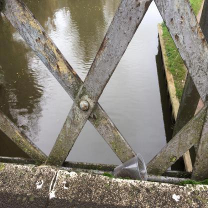

# YOLO V1 TACO

* The TACO (Trash Annotations in Context)

* Objective: 

    * Identify and classify littered trash from photos.
    * Make the code DRY and efficient only use for-loop where absolutely necessary and vectorize all computations.

**How to run:**   
    1. Train models with main.py.  
    2. Use inference.ipynb to test the models.

## Prerequisites
torch version: 2.6.0

<pre style="font-size:.7em">
Data folder structure:
root/  
└── data/  
    ├── train/  
    │   ├── images/  
    │   ├── labels/  
    │   └── train.csv  
    ├── test/  
    └── valid/  
</pre>

## Dataset

<a href="https://www.kaggle.com/datasets/vencerlanz09/taco-dataset-yolo-format">Dataset Link</a>

Classes (num=18)

|          |           |           |
|------------------------|--------------------|------------------|
| Aluminum foil          | Bottle           | Bottle cap           |
| Broken glass           | Can                | Carton           |
| Cigarette              | Cup                | Lid              |
| Other litter           | Other plastic      | Paper            |
| Plastic bag - wrapper  | Plastic container  | Pop tab          |
| Straw                  | Styrofoam piece    | Unlabeled litter |

The bounding box annotations are normalized relative to the entire image size, ranging from 0 to 1.

This image's labeled class object and its bounding boxes:
<table border="1">
    <tr>
        <td>Class</td>
        <td>X</td>
        <td>Y</td>
        <td>Width</td>
        <td>Height</td>
    </tr>
    <tr>
        <td>7 = cup</td>
        <td>0.6274038461538461</td>
        <td>0.8028846153846154</td>
        <td>0.16346153846153846</td>
        <td>0.13341346153846154</td>
    </tr>
</table>

x and y values is to get the position of the mid-point.  
w and h are fraction of full image width/height.  
(0, 0) is top-left  
(1, 1) is bottom-right  

The dataset includes 6004 images.
Litter bounding boxes are annotated in YOLOv8 format.

The following pre-processing was applied to each image:

* Auto-orientation of pixel data (with EXIF-orientation stripping)
* Resize to 416x416 (Stretch)

The following augmentation was applied to create 2 versions of each source image:

* 50% probability of horizontal flip
* 50% probability of vertical flip
* Equal probability of one of the following 90-degree rotations: none, clockwise, upside-down

train: contains 4200 images  
val: contains 1704 images  
test: contains 100 images  

## Bounding Box Coordinate Formats in YOLOv1

There are two types of bounding box (bbox) coordinate formats: **mid-point** and **corner-points**.

### Mid-point format: `(x, y, w, h)`  

* `x`, `y` represent the center point of the bounding box.  

* In **YOLOv1**, `x` and `y` are relative to the **grid cell** that predicts the object.  
  That means `x`, `y` are in the range `[0, 1]`, where `(0,0)` is the top-left of the cell and `(1,1)` is the bottom-right of the same cell.  
* `w` and `h` represent the width and height of the bounding box, **relative to the entire image**.

### Corner-points format: `(x_min, y_min, x_max, y_max)`  

* `x_min`, `y_min` represent the top-left corner of the bounding box.  

* `x_max`, `y_max` represent the bottom-right corner.  
* These coordinates are typically relative to the **entire image**, and are often derived from mid-point format during postprocessing steps such as **IoU calculation**, **visualization**, or **NMS**.

**YOLOv1** uses mid-point format for its predictions, however it's simpler to use corner-points for NMS and IOU calculations. They are easily convertible.

## How To Structure Dataset To Train Model

From paper: "Each bounding box consists of 5 predictions: x, y, w, h, and confidence. The (x,y) coordinates represent the center of the box relative to the bounds of the grid cell. The width and height are predicted relative to the whole image".

**S** = 7 <i>split_size.</i>  
**B** = 2 <i>number of bounding boxes the model predicts for each cell.</i>  
**C** = 18 <i>number of classes in the dataset, in the paper they had 20 classes.</i>  

A tensor for a single cell looks like = [nodes_for_classes=18, pc_1, x, y, w, h, pc_2, x, y, w, h] num_nodes=28.  
pc_1 and pc_2 is probability score.

To get the **total number of nodes that a single cell** has in a label for one image:  

* Formula: C + 5 *B -> 18 + 5* 2 = 28

* That 28 tensor looks like -> [*classes, pc_1, bbox1_x_y_w_h, pc_2, bbox2_x_y_w_h].
* the * 5 is for the second bbox in the cell -> pc_2, x, y, w, h

To get the **total number of nodes that each label** has for one image.

* S *S* (C + B *5) -> 7* 7 *(18 + 2* 5) = 1,372

* Also  7x7=49 -> 49*28 = 1,372
* the * 5 is for the second bbox in the cell -> pc_2, x, y, w, h

Steps.  

* Get the labels in format (7x7x28).
* Get the image as a PIL tensor.
<!-- TODO -->

### YOLO v1 Architecture
